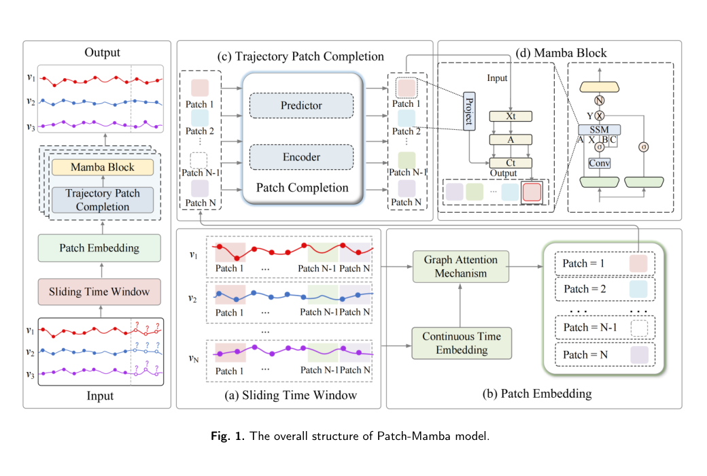

# 🚢 Patch-Mamba: Ship Trajectory Prediction for Irregular Multivariate Time Series

**Patch-Mamba** is a deep learning framework for **real-world ship trajectory prediction** under **irregular sampling intervals, missing observations, and heterogeneous maritime data sources**.

Unlike conventional trajectory forecasting methods that rely on **spatiotemporal interpolation or trajectory reconstruction** before training, Patch-Mamba is designed to **directly model irregular multivariate trajectory sequences**. This makes it especially suitable for practical maritime scenarios where observations are sparse, incomplete, and collected from different monitoring systems.

---

## ✨ Highlights

- **Designed for real-world maritime data** rather than idealized, uniformly sampled trajectories.
- **Directly models irregular multivariate time series** without requiring heavy preprocessing.
- **Patch-based trajectory representation** captures both local motion patterns and long-range dependencies.
- **Patch completion mechanism** improves robustness when observations are missing or sliding windows become empty.
- **Mamba-based sequence backbone** provides efficient long-sequence modeling with selective state-space transitions.
- **Validated on multiple real-world datasets**, including MRST, EMO, DMA, and USCG.

---

## 🧠 Model Architecture

The overall framework consists of three tightly coupled components:

1. **Patch Embedding Module**  
   Converts irregular trajectory points into multi-scale temporal patches using sliding time windows, continuous time embedding, and graph-based intra-patch aggregation.

2. **Patch Completion Module**  
   Reconstructs missing or empty patches with a mask-denoising strategy, improving trajectory continuity and representation quality.

3. **Mamba Prediction Backbone**  
   Uses both embedded patches and completed patches to model global trajectory evolution through a selective state-space framework.

  

<em>Overall architecture of Patch-Mamba.</em>

---

## 📌 Why Patch-Mamba?

Real-world ship trajectory prediction is fundamentally different from standard sequence forecasting:

- **Sampling intervals are not uniform**.
- **Observations are often missing** because of communication interruption, sensor coverage gaps, or practical acquisition issues.
- **Different maritime systems** provide trajectories with different characteristics, such as AIS, BDS, and Radar.

These properties make many conventional sequence models less reliable unless the data are first interpolated into regular time series. However, interpolation may introduce artificial points and distort real vessel motion patterns.

Patch-Mamba addresses this challenge by learning directly from raw irregular trajectories and by explicitly modeling:

- **local spatiotemporal dynamics** inside each patch,
- **missing observation recovery** through patch completion,
- **global temporal dependency modeling** with Mamba.

---

## 🔬 Core Ideas

### 1. Time-Aware Patch Embedding

Instead of treating each trajectory point independently, Patch-Mamba partitions a trajectory into temporal patches. Within each patch, continuous time embedding and graph attention are used to capture local spatial-temporal relations among irregular observations.

### 2. Patch Completion for Missing Observations

In real maritime data, some windows may contain very few points or even no points at all. Patch-Mamba introduces a dedicated completion module that infers latent patch representations from contextual trajectory information, improving continuity and robustness.

### 3. Mamba for Efficient Long-Sequence Forecasting

The completed patch sequence is passed into a Mamba-based backbone, which efficiently models long-range trajectory dependencies while maintaining favorable computational scalability.

---

## 📊 Supported Data Sources

Patch-Mamba is designed for **multi-source maritime trajectory prediction**, including:

- **AIS** — Automatic Identification System
- **BDS** — BeiDou Navigation Satellite System
- **Radar** — shore-based radar monitoring trajectories

It is especially suitable for:

- irregular time intervals,
- missing trajectory observations,
- multi-sensor heterogeneous trajectory data,
- medium- and long-horizon ship trajectory forecasting.

---

## 📦 MRST Dataset

This project is built around **MRST**, a real-world ship trajectory dataset collected from multiple maritime monitoring systems.

### Dataset characteristics

- **Sources:** AIS, BDS, Radar
- **Sequence durations:** 2 h / 4 h / 6 h
- **Properties:** irregular observations, missing data, heterogeneous sensing conditions

MRST is intended to better reflect practical maritime trajectory forecasting conditions than idealized benchmark settings.

---

## 🏆 Experimental Summary

Extensive experiments show that Patch-Mamba achieves strong and robust performance on both public and real-world ship trajectory datasets.

### Evaluated datasets

- **AIS**
- **BDS**
- **RADAR**

### Main observations

- Patch-Mamba performs especially well on **irregular and incomplete trajectories**.
- The model shows clear advantages on **highly irregular AIS trajectories**.
- The patch embedding and patch completion components both contribute substantially to the final performance.
- The framework remains effective across different observation lengths and forecasting horizons.

---

## 🚀 Potential Applications

- Maritime traffic prediction
- Collision risk warning
- Vessel route planning
- Marine traffic management
- Intelligent ocean monitoring
- Multi-source maritime data analysis

---

## 📁 Project Scope

This repository is intended to provide:

- the Patch-Mamba model implementation,
- training and evaluation scripts,
- dataset processing utilities,
- benchmark comparisons,
- reproducible experiments for real-world ship trajectory prediction.

---

## 📎 Paper

If this project is relevant to your research, please cite our work.

**Title:** *Patch-Mamba: A novel trajectory prediction model for various real-world ship trajectory data with irregular multivariate time series*

---

## 🤝 Acknowledgement

Patch-Mamba is motivated by the practical need for **trajectory forecasting under real maritime sensing conditions**, where irregularity and incompleteness are the norm rather than the exception.
